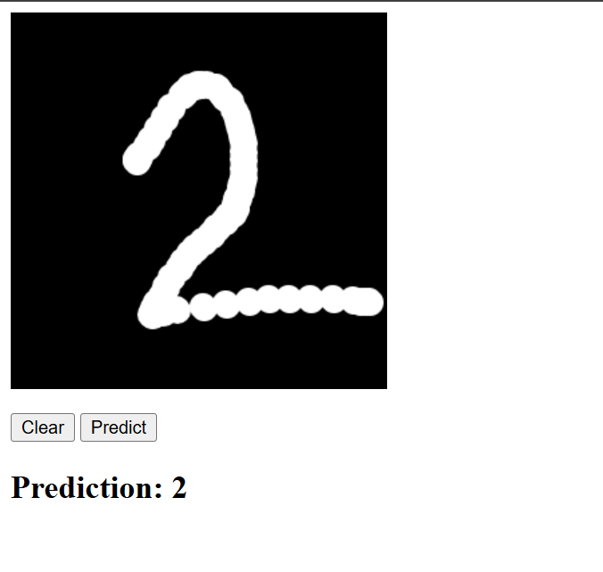
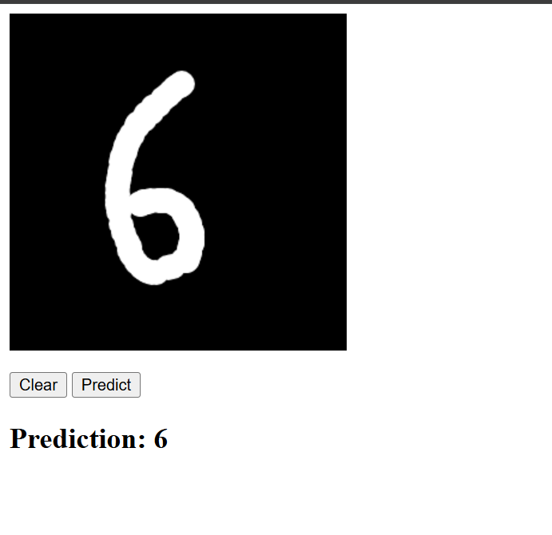
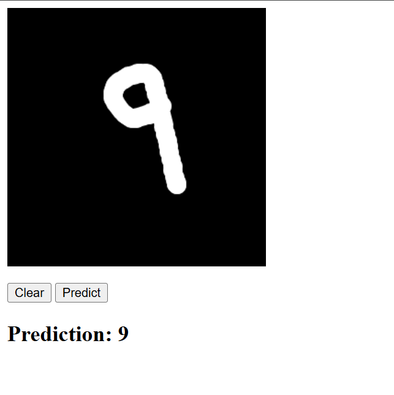
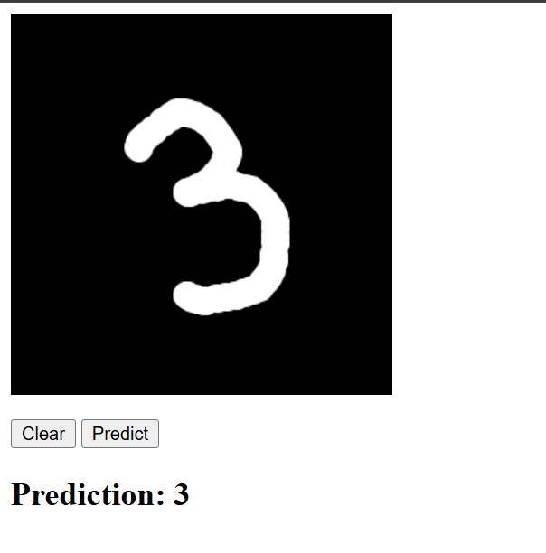

# MNIST Digit Recognition Web Application (Django)

This project is a web-based handwritten digit recognition system built using a **neural network trained from scratch on the MNIST dataset** and integrated into a **Django web application**. Users can draw a digit on a canvas, and the model predicts the digit drawn by the user.






---

## Overview

The purpose of this project is to demonstrate:
- Implementation of a neural network **without using deep learning frameworks**
- Training on the MNIST handwritten digit dataset
- Deployment of the trained model in a Django-based web application
- Real-time digit prediction from user-drawn input

---

## Model Details

- **Dataset:** MNIST
- **Input Size:** 28 × 28 (flattened to 784)
- **Hidden Layers:** Fully connected layers
- **Activation Function (Hidden Layers):** ReLU
- **Activation Function (Output Layer):** Softmax
- **Loss Function:** Cross entropy
- **Training:** Manual forward propagation, backpropagation, and weight updates

No high-level machine learning libraries such as TensorFlow or PyTorch were used.

---

## Web Application Functionality

- Interactive HTML5 canvas for digit drawing
- Captures user input as image data
- Preprocesses input to match MNIST format
- Sends processed data to the trained model
- Displays the predicted digit to the user

---

## Technology Stack

### Backend
- Python
- Django
- NumPy

### Frontend
- HTML
- CSS
- JavaScript (Canvas API)


---

## Dataset Information

- **MNIST Handwritten Digits Dataset**
- 60,000 training images
- 10,000 test images
- Grayscale images of size 28×28

---

## Results

- The model is capable of 92% accurately predicting handwritten digits.
- Predictions are generated in real time through the web interface.
- The project is suitable for learning and demonstration purposes.

---

## Future Enhancements

- Add convolutional neural network (CNN) support
- Improve UI/UX of the drawing canvas
- Display prediction confidence scores
- Add model evaluation metrics
- Support mobile and touch devices

---

## License

This project is intended for educational and research purposes.

---


## Running the Project

Follow the steps below to run the MNIST Digit Recognition Django application on your local machine.

---

### Prerequisites

Ensure the following are installed on your system:

- Python 3.8 or higher
- numpy
- django
- Virtual environment support (recommended)

---

### Step 1: Clone the Repository

```bash
git clone https://github.com/Afshinfathi21/digit-recognizer.git
python3 -m venv venv
source venv/bin/activate
pip install -r requirements.txt
cd digit-recognizer
python manage.py runserver


